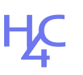

# Hack4Change - Hackathon CPGoiás S3

# Guardians - Hack4Change

## Integrantes:
- <a href="https://www.linkedin.com/in/elisaflemer/"> Elisa Flemer</a>
- <a href="https://www.linkedin.com/in/priscila-falc%C3%A3o-3435a1244/">Priscila Falcão</a>
- <a href="https://github.com/BartonThomas">Thomas Barton</a>
- <a href="https://www.linkedin.com/in/victor-severiano-de-carvalho-b57a05237/">Victor Carvalho</a> 

-----------------

O Guardian é um projeto dedicado a prevenir, identificar e combater a violência escolar por meio da utilização da tecnologia blockchain. Nosso objetivo é promover um ambiente seguro nas escolas, melhorar a comunicação entre os profissionais educacionais e garantir o acompanhamento adequado dos alunos.

## Motivação 

 A violência escolar é um problema sério que afeta inúmeras vidas e compromete o ambiente educacional. No entanto, uma das dores mais significativas que enfrentamos nessa questão é a falta de registro e compartilhamento eficiente de informações. Sem um sistema confiável para documentar e acompanhar o histórico dos alunos, ocorre uma perda de informações cruciais que poderiam ajudar a prevenir incidentes futuros. Com frequência, situações preocupantes ocorrem em uma escola e, quando um aluno se transfere para outra instituição, os professores não têm acesso a informações relevantes sobre o seu passado. Isso resulta em uma falta de compreensão do contexto individual de cada aluno e dificulta a identificação precoce de problemas ou sinais de alerta. Além disso, a comunicação entre escolas diferentes pode ser fragmentada e ineficiente, levando a uma falta de colaboração na prevenção e no combate à violência escolar. O Guardian propõe uma solução inovadora baseada em blockchain para resolver esse problema.

Através da tecnologia blockchain, o Guardian garante o registro confiável, transparente e instantâneo de ocorrências na vida dos alunos, como brigas, traumas, boletins de ocorrência e outros eventos relevantes. Essas informações são armazenadas de forma segura e podem ser acessadas por professores autorizados de qualquer lugar do Brasil. Além disso, nosso roadmap inclui a implementação de uma blockchain privada para que apenas os profissionais autorizados, como professores, policiais e gestores, tenham acesso a informações confidenciais dos alunos.

## Características Principais
O Guardian possui as seguintes características principais:

**1. Registro de Ocorrências**
O sistema permite o registro de ocorrências na vida dos alunos, incluindo brigas, traumas, boletins de ocorrência e outros eventos relevantes. Essas informações são armazenadas de forma segura na blockchain, proporcionando um histórico completo e confiável do aluno.

**2. Acesso a Informações dos Alunos**
Qualquer professor autorizado pode acessar as informações registradas na blockchain sobre seus alunos. Isso permite um melhor entendimento do contexto de cada aluno, ajudando a identificar sinais de alerta e a tomar medidas preventivas adequadas.

**3. Denúncias Anônimas**
O Guardian disponibiliza uma aba de denúncias, onde qualquer pessoa pode fazer uma denúncia anônima em relação a um aluno. Essas denúncias são armazenadas em um banco de dados até que sejam aprovadas por um professor ou gestor antes de serem registradas na blockchain. Isso ajuda a garantir a veracidade das denúncias e evitar informações falsas ou difamatórias.

**4. Algoritmo de Processamento de Linguagem Natural**
Implementamos um algoritmo de processamento de linguagem natural que identifica automaticamente toxicidade, cyberbullying e sinais de alerta em comentários nas redes sociais. Esse algoritmo é integrado ao backend do Guardian e, em futuras versões, será conectado a uma ferramenta de webcrawling para monitorar as redes sociais de alunos de alto risco. Caso sejam encontrados comentários preocupantes, notificações serão enviadas através do aplicativo.

**5. Hotline para a Polícia**
O Guardian oferece uma hotline direta para a polícia, permitindo um acesso rápido e eficiente às autoridades em caso de emergências ou situações críticas.

## Tecnologias Utilizadas

O Guardian é construído utilizando uma variedade de tecnologias para garantir a eficiência, segurança e escalabilidade do projeto:

**Backend em Node.js e MongoDB:** Optamos por utilizar o Node.js devido à sua capacidade de lidar com operações assíncronas, tornando o sistema mais responsivo. Além disso, o MongoDB é uma escolha adequada para o armazenamento dos dados, pois oferece flexibilidade e escalabilidade necessárias para lidar com o registro das ocorrências.

**Frontend em Next.js, Ether.js e Tailwind CSS:** Escolhemos o Next.js para o desenvolvimento do frontend devido à sua capacidade de renderização do lado do servidor, proporcionando uma experiência de usuário mais rápida. O Ether.js é uma biblioteca poderosa para interagir com a blockchain Ethereum, permitindo a comunicação com os contratos inteligentes do Guardian. O Tailwind CSS é utilizado para a estilização do aplicativo, oferecendo uma abordagem moderna e flexível para o design da interface.

**Smart Contracts em Solidity:** Utilizamos a linguagem Solidity para desenvolver os contratos inteligentes do Guardian. Esses contratos são responsáveis por registrar as ocorrências na blockchain, garantindo a integridade e confiabilidade dos dados. Implementamos um sistema de NFTs (Non-Fungible Tokens) para representar as ocorrências dos alunos. Existe um contrato chamado "Aluno Factory" que armazena os endereços dos alunos e cria novos alunos como smart contracts. Além disso, desenvolvemos templates de NFTs para diferentes tipos de ocorrências, como episódios traumáticos, brigas, bullying, etc. Esses templates podem ser personalizados para cada caso específico. As autoridades podem atribuir e emitir esses NFTs aos contratos que representam cada aluno.

**Processamento de Linguagem Natural com Naive Bayes:** Implementamos um algoritmo de processamento de linguagem natural baseado no Naive Bayes para identificar toxicidade, cyberbullying e sinais de alerta em comentários nas redes sociais. Atualmente, o modelo está treinado com um dataset em inglês. No roadmap, temos a intenção de expandir e adaptar o algoritmo para suportar a versão em português, proporcionando uma análise mais precisa e contextualizada das interações nas redes sociais dos alunos.

## Como Contribuir
O Guardian é um projeto de código aberto e encorajamos a comunidade a contribuir para o seu desenvolvimento. Caso deseje contribuir, siga as etapas abaixo:

Faça um fork do repositório do Guardian no GitHub.
Crie uma branch para as suas alterações: git checkout -b minha-feature.
Faça as alterações desejadas e adicione os devidos testes.
Envie um pull request para a branch principal do Guardian.
Agradecemos antecipadamente por suas contribuições para tornar as escolas um ambiente mais seguro e acolhedor.

## 📝 Descrição
Tendo em vistas os recentes casos de ataques nas escolas do Brasil, a equipe de desenvolvedores Hack4Change buscou desenvolver uma solução que pudesse auxiliar na prevenção e combate a esses casos. Para isso, foi desenvolvido o Guardians, um sistema que utiliza de inteligência artificial e blockchain para promover a proteção dos alunos e profissionais.
  
Sabendo da segurança que a blockchain proporciona, com criptografia de dados, além da eficiência e velocidade, que permite a execução de transações de informação de forma direta e automatizada, somado a descentralização, garantindo a comunicação eficaz dentre os agentes, o Guardians utiliza dessa tecnologia para integrar sistemas de escolas e pilares da segurança pública, garantindo a integridade dos dados transmitidos. 
  
Além disso, estudos apontam que casos de violência nas escolas, atualmente são comunicados ou identificáveis pelas redes sociais. Neste sentido, notou-se como um ponto de vulnerabilidade que precisava ser atendido pela solução, na qual traduziu-se no  uso de inteligência artificial para analisar os perfis dos jovens e adolescentes nas redes sociais, buscando conteúdos que pudessem refletir posteriormente em possíveis casos de risco, como bullying, ataques e outros.
  

## 📄 Análise de mercado
descrever cenário, problema e fontes de pesquisa

## → Value Preposition Canvas
 Value Proposition Canvas é um template de negócios que ajuda a entender o valor da sua solução para a empresa, englobando seus pontos fortes e principalmente, como esses ajudam a resolver dores do cliente. Assim, para análise de forma mais profunda da viabilidade, aplicabilidade e valor do produto proposto, realizou-se o preenchimento do documento. É possível visualizar a proposta de valor do projeto na imagem a seguir:

-----------------

## 📁 Estrutura de pastas

|📂[front](./front) 
 &emsp;|📂[frontend](./front/frontend) 
|📂[blockchain](./blockchain/) 
      &emsp; &emsp;|📂[build](./blockchain/build/) 
      &emsp; &emsp;|📂[contract](./blockchain/contracts/) 
|📂[AI](./AI) 
| readme.md 

 

Dentre os arquivos presentes na raiz do projeto, definem-se:
<lu>
<li><b>readme:</b> arquivo de introdução, contendo informações gerais sobre o projeto - arquivo atual.

<li><b>front:</b> contém os arquivos referentes ao front-end do projeto, que é a interface com o usuário. Esse desenvolvido em NextJS, com o uso de tecnologias como TailwindCSS, ReactJS e JavaScript.

<li><b>blockchain:</b> possui o código fonte para a produção e configuração do sistema de blockchain do projeto, que é responsável pela segurança dos dados gerados e armazenados. Esse desenvolvido em Solidity.

<li> <b>ai:</b> este arquivo trata-se da produção e configuração do sistema de inteligência artificial do projeto, que é responsável pela análise dos dados gerados e armazenados. Esse desenvolvido em Python, usando do modelo Light GBM e datasets exemplares do Kaggle.
</lu>

 

-----------------

## 💻 Execução do projeto

Um guia para a execução desse projeto pode ser encontrado no conteúdo do vídeo a seguir:
<a>Vídeo e apresentação</a>

# Referências

# 📋 Licença/License

<a property="dct:title" rel="cc:attributionURL" href="https://github.com/elisaflemer/protectedo">Guardians</a> by Hack4Change is licensed under <a href="http://creativecommons.org/licenses/by/4.0/?ref=chooser-v1" target="_blank" rel="license noopener noreferrer" style="display:inline-block;">Attribution 4.0 International</a>.

